# Generala Offline

## Resumen

Al iniciar la aplicacion podemos iniciar con el usuario que ya esta ingresado (usuario: pepe, contraseña: pepe).

inserte imagen menu principal

Una vez iniciado del lado izquierdo tenemos las distintas opciones:
- Iniciar Partida
  * Demo: La partida demo simula una partida entre 2 a 4 jugadores, son 3 manos por jugador.
  * Partida Completa: Simula una partida completa, 7 turnos por jugado.
Sea cual sea la opcion elegida, nos mostrara la lista de jugadores y un panel con la cantidad de jugadores que deseamos tener en la partida, una vez seleccionamos la cantidad le damos a aceptar y seleccionamos
los jugadores haciendo click 2 veces. Al seleccionar el ultimo jugador la partida se inicia automaticamente permitiendote elegir la cantidad de jugadores nuevamente y generar otra partida.
inserte foto
- Partidas
  * Activas: Muestra las partidas activas, haciendo doble click sobre una partida nos muestra la partida en curso, si seleccionamos la partida podemos cancelarla con el boton que tenemos debajo.
  inserte foto
- Jugadores
  * Registro: Nos permite generar un nuevo usuario siempre y cuando su nombre de usuario no exista.
  * Existentes: Muestra los usuarios existentes.
- Estadisticas: Muestra las distintas estadisticas.

En la izquierda superior hay 2 botones:
 - "C": Es el boton de configuracion visual del programa, donde podemos cambiar el color y el idioma.
 - "?": Nos muestra las reglas del juego.

## Diagrama de clase

## Justificacion tecnica

- SQL: Se uso sql en distintas partes del programa para persistencia de datos, tambien se usa distintas consultas para los datos de las estadisticas.

 Clase ConexionBdPartida:
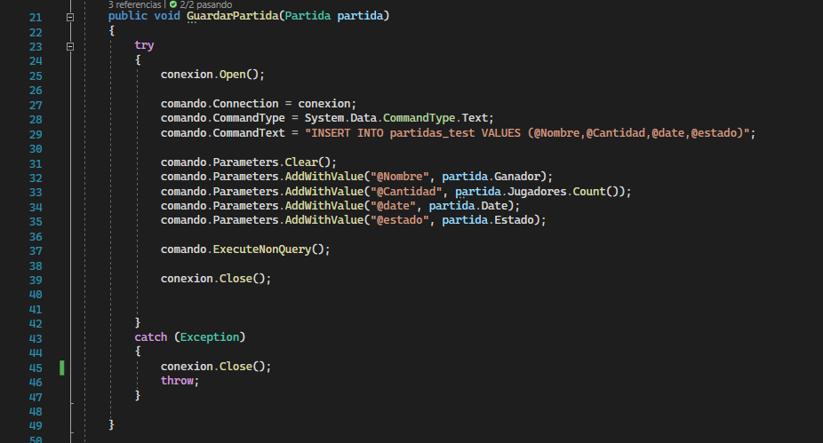

- Excepciones: Se usan distintos bloques de try/catch a lo largo del programa para atajar los posibles errores.

 Clase frm_MenuPrincipal
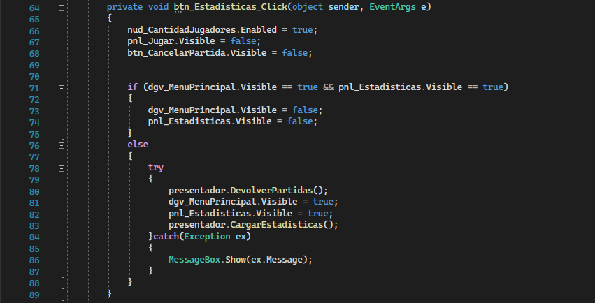

- Unit Testing: Se genero un proyecto "Funcionalidades_Test" para comprobar el correcto funcionamiento de los metodos. No se probaron todos los metodos dado su nivel de proteccion o uso de los mismos.

 Proyecto Funcionalidades_Test:
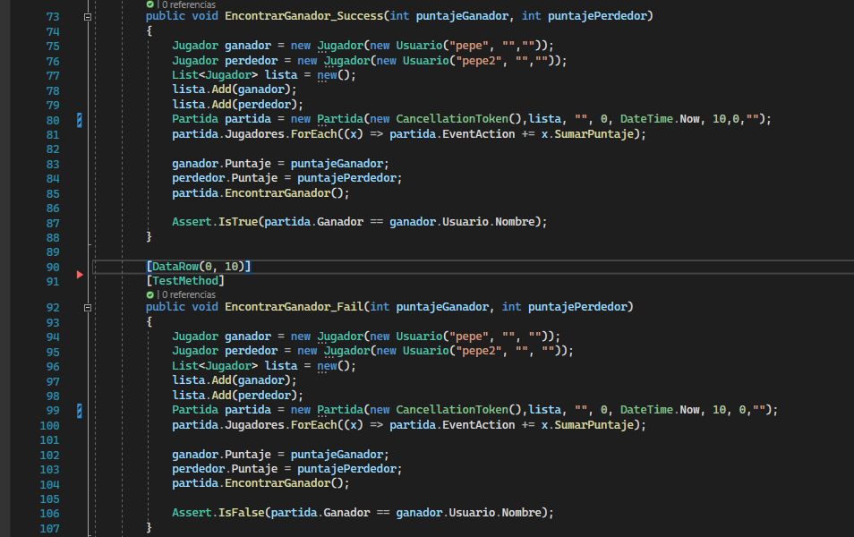

- Generics: Se uso generics para la clase serializadora, asi esta puede serializar cualquier tipo de dato.
 
 Clase Serializadora:
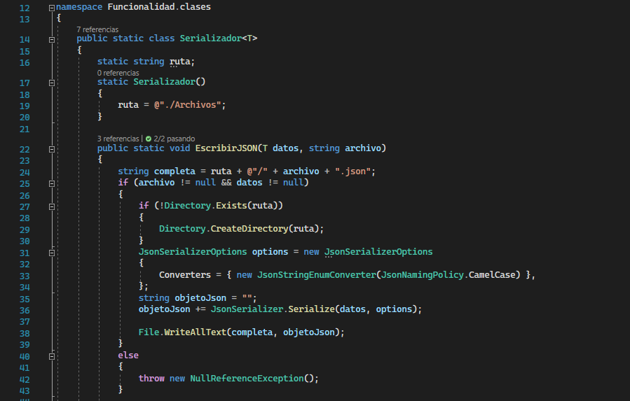

- Serializacion: Se hizo una clase serializadora que genera archivos .json. En el programa se usa para guardar las configuraciones de color e idioma.

 Clase frm_Login:
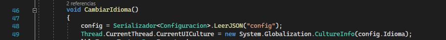
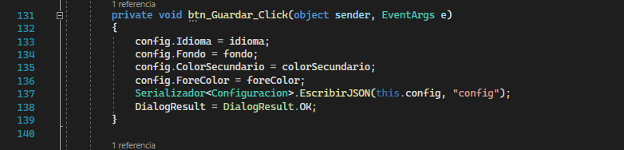

- Archivos: Se hizo una clase de archivos para guardar el resumen de la partida si es que el usuario lo desea.

 Clase Partida:
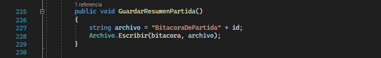

- Interfaces: Se utilizo interfaces para lograr un modelo de MVP, generando una interfaz por cada formulario.

 Interface IMenu:

- Delegados: Se uso delegados para el movimiento de metodos entre distintas clases, por ejemplo el uso de "DTiradas" en la clase jugador, que ejecuta todos los checkeos de las tiradas de los jugadores.

 Clase Jugador:
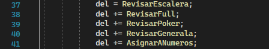
 Clase Parida:
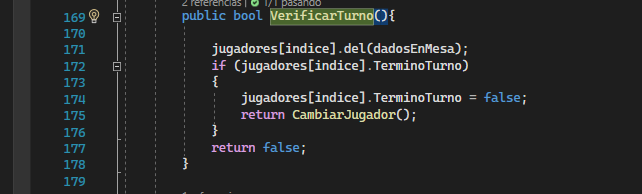

- Task: Se uso tareas para la ejecucion de partidas en segundo plano, estas corren sin que tengan que ser visualizadas.

 Clase Partida:
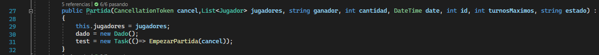

- Eventos: Se usa eventos en varios lugares, por ejemplo a la hora de mostrar informacion en pantalla, se usa el evento "mostrarInfo" para mostrar en pantalla en caso de que haya un formulario abierto.
Tambien se usa un evento para encontrar al ganador de la partida.

 Clase Partida:

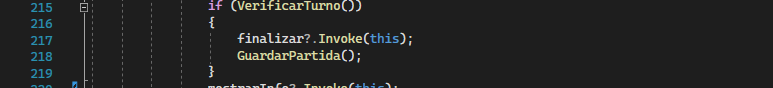
